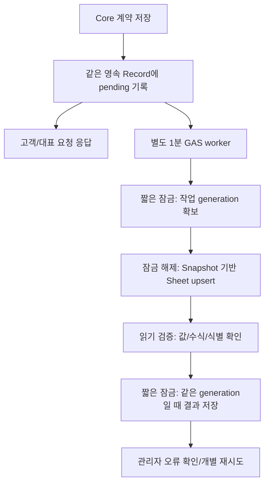

# 선택형 Google Sheets 계약목록

## 목차

1. 운영자 사용 방법
2. ON/OFF와 공식 원본
3. 생성·연결정보와 권한
4. 계약목록 컬럼
5. 동기화와 장애 복구
6. 개인정보와 제한
7. 검증 및 실제 계정 확인

## 1. 운영자 사용 방법

PC의 `/studio-control`에 로그인하고 **외부 연동 → Google Sheets 계약목록**을 선택한다.

1. 기본값은 **사용 안 함**이다. Sheet 없이 계약 접수·대표 알림·검토·확정·PDF·고객/대표 이메일·Drive 보관을 사용할 수 있다.
2. 계약목록 사용을 켜고 확인한다. 상품·가격·약관 설정과 별도로 즉시 저장한다.
3. **새 계약관리 Sheet 만들기**를 누른다. 연결 후 이름·생성일·Google Sheets에서 열기 링크를 확인한다.
4. **동기화 상태 확인**에서 오류·대기·완료를 확인한다. 조회는 한 번에 Drive 파일 30개 범위다. **다음 계약 상태 확인**으로 다음 범위를 누적 조회한다. 표시 건수는 조회한 기록의 건수이며 전체 계약 통계가 아니다.
5. 실패 또는 처리 여부 불명 계약은 원인을 확인하고 **다시 동기화**한다. 고객 재제출과 이메일 재발송은 필요 없다.

로컬 Demo는 연결과 최소 컬럼 기록을 비공개 로컬 파일로 모의한다. 실제 Google 파일·링크·시간 기반 작업을 생성하지 않는다. 화면에도 이를 표시한다.

## 2. ON/OFF와 공식 원본

공식 원본은 영속 계약 Record·확정 Snapshot·저장 PDF·발송 상태다. Sheet는 **Core → Sheet 단방향 운영용 복사본**이다. Sheet에서 이름·금액·상태를 수정해도 계약과 이메일에 반영되지 않는다.

OFF는 앞으로 시작할 자동 동기화를 중지한다. 이미 시작한 작업은 끝날 수 있다. Sheet 파일을 삭제하거나 기존 계약 자료를 지우지 않는다. 기존에 추적하던 계약의 변경은 대기로 보존해 다시 ON하면 최신 원본으로 동기화한다. OFF에서 처음 접수한 과거 계약을 일괄 가져오지는 않는다.

연동 설정은 Business Config revision/hash와 분리한다. ON/OFF·생성·연결 상태 확인은 고객 계약의 가격·약관 binding을 바꾸지 않으며 미처리 계약을 무조건 차단하지 않는다. Business Config 변경·history/restore 보호는 기존대로 유지한다.

짝꿍 할인은 계속 비공개 업체 설정 revision에서 검증한다. Sheet를 할인 코드 DB로 사용하지 않는다.

## 3. 생성·연결정보와 권한

GAS는 배포 실행 계정으로 `SpreadsheetApp.create`를 호출하고 **{업체 표시명} 계약관리**를 만든다. 생성 도중에는 고유한 예약 이름을 사용하고 ID를 저장한 뒤 표시 이름으로 바꾼다. 생성 요청이 유실되면 예약 이름의 기존 파일부터 확인한다. 생성 여부를 확인할 수 없을 때 새 파일을 자동 반복 생성하지 않는다.

연결 정보는 GAS Script Properties의 `studio_settings_{studioId}_sheet`에 보관한다. 여기에는 독립적인 revision, ON/OFF, 생성 단계/임시 lease, Sheet ID, 탭 ID, 이름, 생성일이 들어간다. APP_SECRET·GAS_SHARED_SECRET·관리자 세션과 다른 키이며 고객 설정 응답에는 포함하지 않는다. 운영자는 ID를 복사해 입력하지 않는다.

생성 파일은 비공개 공유 상태로 지정하고, 동기화 때도 비공개 여부를 확인한다. 공개/도메인 공유 상태면 쓰기를 중단한다. 특정 사용자와의 개별 공유 및 Workspace 관리자 정책은 실제 실행 계정에서 확인해야 한다.

관리자 API는 기존 HttpOnly/SameSite 쿠키·세션·Origin/JSON·서명 GAS 요청을 사용한다. GET은 상태 확인만 한다. 생성/재시도는 POST, ON/OFF는 PUT이며 익명으로 접근할 수 없다. Sheet URL은 관리자 응답에만 포함한다.

GAS에 새 코드를 적용한 뒤 배포 계정에서 Spreadsheet·Drive·설치형 trigger 권한을 승인해야 한다. 사용 ON 시 `contractSheetWorker`의 1분 시간 기반 trigger를 등록한다. OFF 시 trigger 자체는 남아도 모든 연동이 OFF이면 Sheet와 계약 폴더를 조회하지 않고 종료한다.

## 4. 계약목록 컬럼

| 순서 | 컬럼 |
|---|---|
| 1–6 | 계약번호, 접수일시, 예식일, 예식시간, 예식장, 홀 |
| 7–10 | 신랑 이름, 신부 이름, 대표 연락처, 수신 이메일 |
| 11–14 | 상품, 옵션, 즉시할인 / 조정, 사용 할인코드 |
| 15–18 | 계약금액, 계약금, 잔금, 추후 캐시백 |
| 19–23 | 계약 상태, 대표 확인 상태, 계약서 발송 상태, 승인일시, 발송일시 |
| 24 | 시스템 계약ID — 숨김 열 |

첫 행 고정, 한글 헤더, 필터, 열 너비, 금액 숫자 형식과 일시 표시를 설정한다. 예식일/시간은 계약의 날짜 문자열을 보존하고 일시 표시는 Asia/Seoul을 사용한다. 번호·전화번호 등은 텍스트로 처리한다. 값이 수식으로 실행되지 않도록 위험한 시작 문자를 escape하고, 쓰기 후 수식이 없는지 검사한다.

같은 contractId는 같은 논리적 행을 사용한다. 숨김 ID 외에 행 developer metadata도 사용해 사람이 보이는 계약번호/숨김 ID를 수정하거나 행을 정렬해도 식별한다. 파일/탭 이름 변경은 ID로 접근하므로 연결을 바꾸지 않는다. 행 삭제 후 재시도는 같은 원본에서 행을 복구한다. 중복 시스템 ID나 헤더 손상은 덮어쓰지 않고 오류로 중단한다.

## 5. 동기화와 장애 복구



- 최초 접수: 접수 당시 `formData`와 `pricing`으로 **접수**를 표시한다.
- 대표 확정: 저장된 Snapshot의 상품·옵션·할인·금액으로 **대표 확인 완료**를 표시한다.
- 양쪽 발송 및 최종 저장 완료: 최종 Snapshot으로 **계약 완료**, 발송일시를 표시한다.
- 일부 이메일 발송이 불확실하면 Record의 해당 상태를 표시한다. Sheet 성공을 이메일 성공으로 사용하지 않는다.

계약 요청 안에서는 Spreadsheet 서비스에 접근하지 않는다. Record의 `sheetSync`는 pending/working/synced/failed/unknown, generation, 시도일시 등의 최소 상태다. Snapshot·계약 revision·금액을 바꾸지 않는다.

worker는 한 회 최대 Drive 파일 15개를 검사하고 최대 3개 작업을 처리한다. continuation cursor로 다음 범위를 이어간다. 모든 기록을 한 번에 rebuild하지 않는다. 별도 worker lease로 겹친 실행을 방지하며 Sheet 통신 중에는 Core 공용 잠금을 잡지 않는다. 실행이 강제 중단되면 lease는 최대 7분 후 만료한다. `working`은 관리자에게 **처리 여부 확인 필요**로 표시한다.

Sheet 통신 중 새 계약 단계가 저장되면 generation이 바뀐다. 오래된 작업은 새 대기 상태를 synced로 바꾸지 않는다. 다음 작업이 최신 원본으로 갱신한다. 외부 Sheet와 Drive는 분산 트랜잭션이 아니므로 Sheet 표시가 잠시 뒤처질 수 있다.

권한·삭제·공개 공유·헤더 변경·중복 ID는 실패로 남긴다. 쓰기 시작 후 응답/저장 결과가 불분명하면 unknown으로 남긴다. 재시도는 원본의 같은 ID를 찾아 다시 쓰므로 중복 이메일이나 새 계약을 만들지 않는다. 실패/unknown 자동 무한 재시도는 하지 않는다. 개별 재시도는 대기 상태로 등록하고 worker가 처리한다.

## 6. 개인정보와 제한

Sheet에는 승인 token/token hash, 내부 Snapshot hash, secret, 관리자 세션, 전체 payload, 가족 구성·SNS·촬영/후보정 요청·오류 원문을 넣지 않는다. 운영상 필요한 이름·전화·이메일은 비공개 목록에만 기록한다. 연결/행 오류는 제한된 코드로 보관하며 provider 진단을 고객에게 노출하지 않는다.

현재 지원하지 않는 기능:

- 기존 Sheet 연결, 삭제된 Sheet의 자동 교체
- 과거 계약 전체 rebuild/대량 backfill
- Sheet → Core 수정/승인/가격 변경/메일 발송
- Calendar·CRM·Dashboard·직원 계정·멀티테넌트

기존 Sheet 연결과 전체 rebuild는 잘못된 파일·헤더·과거 계약을 대량으로 덮어쓰는 위험과 별도 진행률/중단/복구 설계가 필요해 후속 단계로 남긴다. 시스템 ID 열과 developer metadata를 모두 수동 삭제하거나 타 계약 행에 복사하지 않는다. 숨김 열은 보안 권한이 아니며 비공개 Drive ACL이 필요하다.

## 7. 검증 및 실제 계정 확인

```text
npm run test:sheets
npm run test:settings-browser
npm test
```

자동검증은 실제 Code.gs/API를 실행하되 Google I/O는 모형으로 대체한다. 실제 관리자 Next 브라우저는 명시적 로컬 Demo를 사용한다. 실제 Google I/O, 원격 push, Production/GAS 배포는 수행하지 않는다.

별도 staging에서 확인할 항목:

1. 전용 GAS/Drive 대상과 배포 실행 계정, 새 scope 승인
2. Workspace 공유 정책, 새 Sheet의 비공개 ACL
3. 설치형 trigger 생성·실제 실행·권한 및 Apps Script 할당량
4. 실제 행 developer metadata, 정렬/삭제·쓰기 후 값/수식 확인
5. 두 실제 이메일과 저장 PDF가 정상인 계약의 접수→확정→발송 행 표시
6. Sheets 장애 중 동시 고객/대표 요청과 lease/재시도
7. 기록 규모별 Drive 스캔 시간과 동기화 지연, 관리자 페이지 조회 시간

구현 참고: [SpreadsheetApp.create 공식 문서](https://developers.google.com/apps-script/reference/spreadsheet/spreadsheet-app), [행 developer metadata 공식 문서](https://developers.google.com/apps-script/reference/spreadsheet/range#addDeveloperMetadata(String,String)), [Drive 공유 API 공식 문서](https://developers.google.com/apps-script/reference/drive/file).
